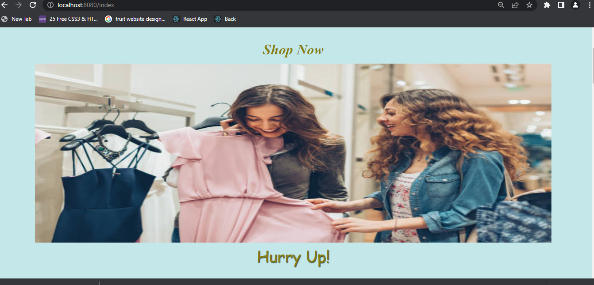
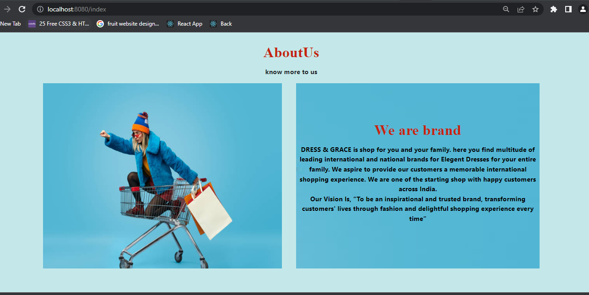
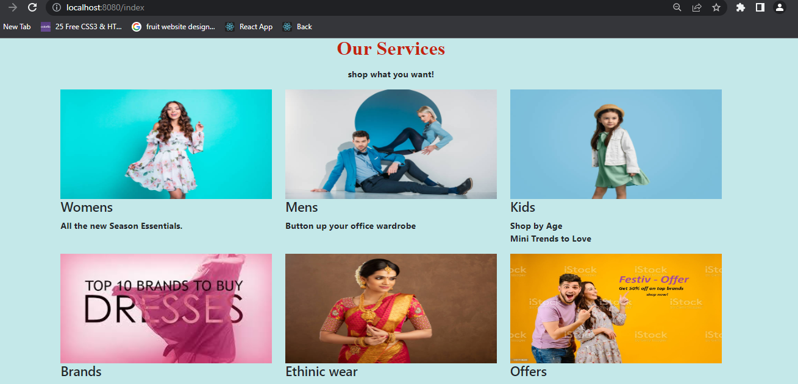
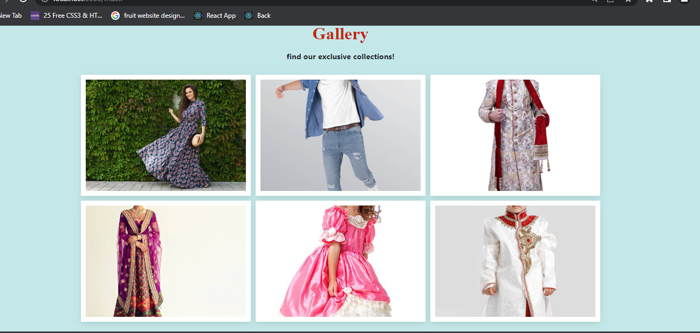
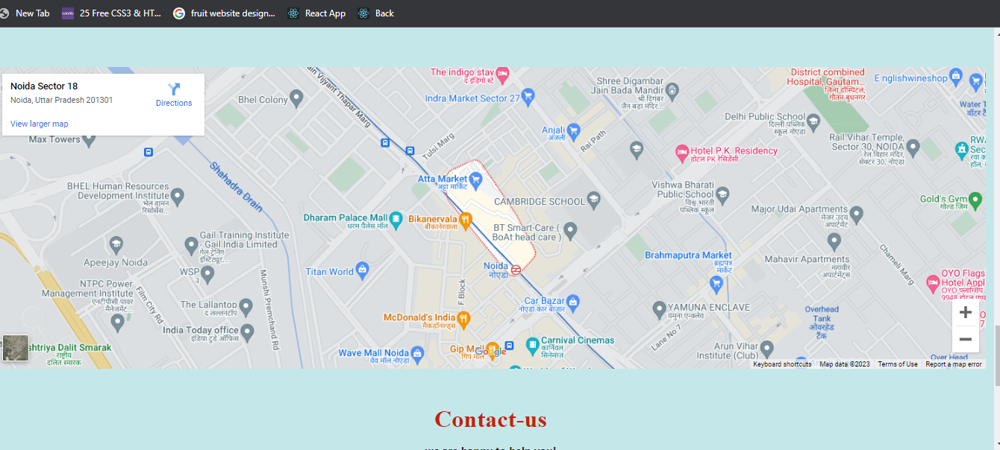
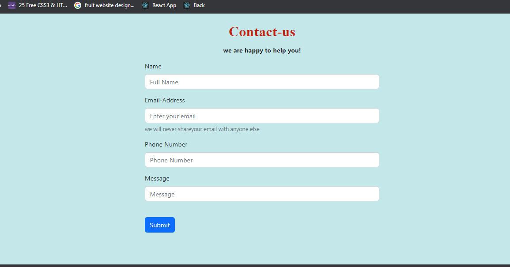
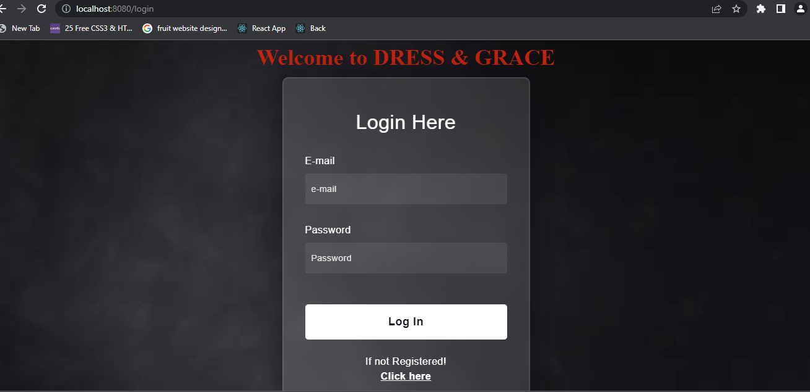
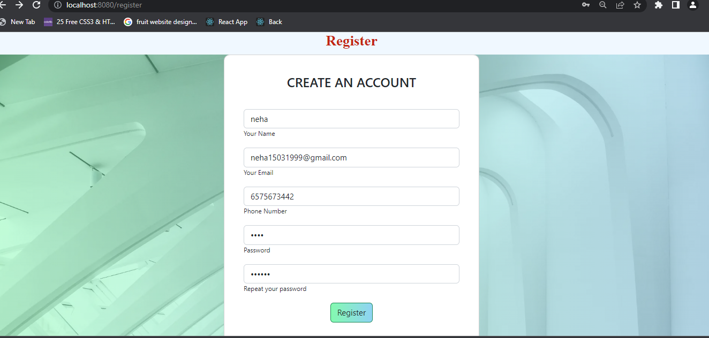

# Dynamic Website

## Poject Desrciption:

Dynamic Website is a web Application  made of using JavaScript's with back-end JavaScript runtime environment Nodejs, MongoDB.This is shopping website application including login page main page and contact us page, with proper configuration of eslint.

## Technology Used:
### For Front-end:
- Javascript :- JavaScript is the Programming Language for the Web. JavaScript can update and change both HTML and CSS. JavaScript can calculate, manipulate and validate data.
- Basic CSS: used to provide basic comfortability to website.
- HBS: hbs is a express. js wrapper for the handlebars. js javascript template engine. Handlebars. js is a template engine to make writing html code easier.

### For Back-end:
- Nodejs- JavaScript runtime environment and library for running web applications outside the client's browser.Node.js uses JavaScript on the server.
- Express - Framework of Nodejs help us to create a http server.
- Dotenv - module allow us to store secret credential of documents.
- Mongoose - Allow us to work with mongoDB.
- Nodemon- Allow us to restart the server whenever we make changes in it. 

## APIs URL
- URL for Home Page - http://localhost:8080/index
-  URL for Conatct-Us Page- http://localhost:8080/index#contactId
- URL for logon page - http://localhost:8080/login

## What I've Learnt :
- Setup of  Nodejs installation of Express, mongodb, etc.
- Setup ES Lint and identifying its error and resolving them.
- writing clean and structure code.
- Creating nodeAPIs.
- creating Routes.
- Creating models and schema.
- Get post methods
- How to connect with mongoDb.
- creating website in nodejs etc. 

## Getting Started with Nodejs Application

This project start with:
open terminal and type:- nodemon merbackend/src/app.js.
Runs the app in development mode and 
Open [http://localhost:8080] to view it in your browser

### Home - Page

NavBar- Section

-EveryLink in navbar is active.

Top Image Section

- This section contain four images and Carousel is applied here automatically images render one by one. 

About-us Section

- when click on About-us link in navbar it will redirect to About-Us section.

Services Section

- when click on Services link in navbar it will redirect to Services section.

Gallery Section

- when click on Gallery link in navbar it will redirect to Gallery section.

Map Section

- it contains map

Contact-us Section

- when clicking on contact-us link in navbar it will redirect to contact-us section.
- After filling form click on submit button it will ridirect to contact page.

### Login - Page

- Here user enter its register email and password and clicking on login it will redirect to home page of shopping website.
- user data was stored in mongoDb.

### Register - Page

- Here user fill thr form to get register himself.
- user data get stored in MongoDb.
